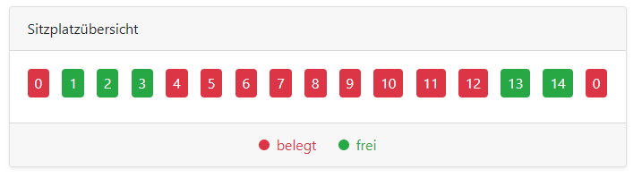
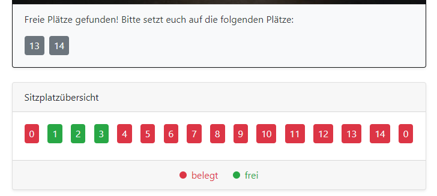
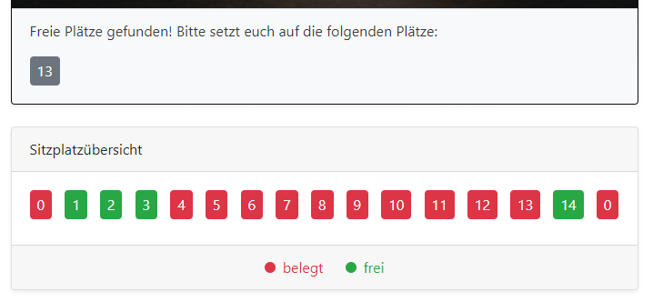
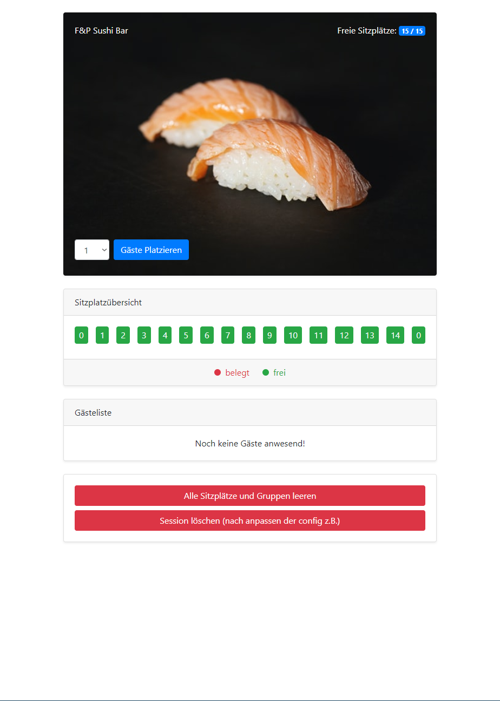
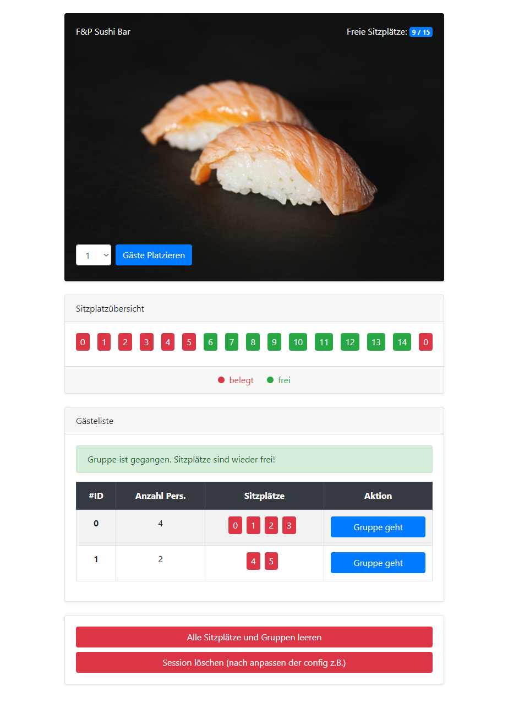

# SushiBar

Content:
* Testing ( https://github.com/g44m33r/SushiBar#php-unit-tests )

Externe Quellen:
* https://getbootstrap.com BootstrapCSS
* https://unsplash.com/photos/wmPDe9OnXT4 Sushi Bild von Luigi Pozzoli

Klassen:
* Sushibar.class.php
* Seat.class.php
* Group.class.php

### Installation:

Einfach das komplette Repo auf den Webserver der Wahl ( mit PHP Untersütztung eg. PHP-FPM + NGINX ) schieben und per Browser aufrufen.
Der Einfachheit halber wurde auf eine Datenbank verzichtet, somit wir die Sushibar Klasse in der $_SESSION gespeichert.

### Demo:

Eine Demo ist unter folgendem Link verfügbar: https://rebhan.dev/sushi/ (Ansicht ist optimiert für Medium-Size)

## Sushibar.class.php

### Konstruktor
Diese Klasse beinhaltet die Sushibar und speichert Objekte der Seat- und Group-Klasse.
```php
private $seat_amount;
private $seats;
private $name;
private $guests = [];
        
/**
    * __construct
    * Konstruktor erstellt die Sushibar
    *
    * @param  string $name
    * @param  int $seats
    * @return void
    */
function __construct($name, $seats) {

    $seats = intval($seats);

    if ( $name === "" ) {
        $name = "F&P Sushibar";
    }
    
    if ( $seats == null || $seats === 0 ) {
        $seats = 10;
    }

    $this->name = $name;
    $this->createSeats($seats);
    $this->seat_amount = $seats;

}
```

Im Konstruktor wird die Sushibar erstellt und in $seats werden Objekte der Klasse Seat als Array gespeichert. Des Weiteren wir der Name und die Anzahl der Sitzplätze in $name und $seat_amount gespeichert.

### Algorithmus zum suchen freier Sitzplätze

Der Algorithmus zum suchen des besten freien Sitzplatzes mit der wenigsten Verschwendung besteht aus folgenden Funktionen:

* findFreeSeats($groupAmount)
* rec_findFreeSeat($currentSeat, $remainingSeats, $direction)
* evaluateStartingPoints($possibleStartingPoints,$groupAmount)

Die Funktion findFreeSeats($groupAmount) funktioniert wie folgt:

```php
/**
    * findFreeSeats
    * Funktion um freie Sitzplätze für die Gruppengröße $groupAmount zu finden
    * Gibt ein Array an möglichen Sitzplätzen zurück
    * @param  int $groupAmount
    * @return Seat[] inkl. Seat Score
    */
function findFreeSeats($groupAmount) {
    $possibleStartingPoints = [];

    # Durchlaufen der Sitzplätze

    foreach ($this->seats as $id => $seat) {

        if ( $seat->isFreeSeat() ) {
            # Sitz ist frei

            # Prüfen ob rec_findFreeSeat() die Zahl an $groupAmount in die jeweilige Richtung zurückgibt
            # Falls ja dann sind die nötigen Plätze in dieser Richtung frei
            # Somit wird der aktuelle Sitz als Startpunkt + Richtung dem Array hinzugefügt
            if ( $this->rec_findFreeSeat($id, $groupAmount, "left") === $groupAmount ) {
                array_push($possibleStartingPoints, array("seatID" => $id, "direction" => "left"));
            }
            if ( $this->rec_findFreeSeat($id, $groupAmount, "right") === $groupAmount ) {
                array_push($possibleStartingPoints, array("seatID" => $id, "direction" => "right"));
            } 
        }

    }
    # Wenn das Array $possibleStartingPoints leer ist gibt es keine Sitzplätze für die Anzahl an Personen
    # die verschiedenen Sitzplätze werden jetzt bewertet um so wenig Platz wie möglich zu verschwenden
    return $this->evaluateStartingPoints($possibleStartingPoints,$groupAmount);
}
```

Zuerst wird geprüft, welche Sitzplätze noch frei sind. Von den freien Sitzplätzen wird dann per Rekursiver Funktion in beide Richtungen geschaut ob die Gruppe mit der Größe $groupAmount noch Platz findet. In beide Richtungen deshalb, da es sich um einen Kreisförmigen Tisch handelt und die Sitzplätze um diesen herum angeordnert sind.

Diese Rekursive Funktion durchläuft die Sitzplätze und addiert eine 1 falls der Sitz frei ist und eine 0 falls der Sitz belegt ist. Somit ist zu prüfen ob das Resultat mit der Gruppengröße übereinstimmt, falls ja dann wird der Start-Sitzplatz in das Array $possibleStartingPoints mit der jeweiligen Richtung eingefügt.

Die Funktion rec_findFreeSeat($currentSeat, $remainingSeats, $direction) funktioniert wie oben beschrieben. Des Weiteren muss noch geprüft werden ob wir beim durchlaufen der Sitzplätze über das Ende bzw unter den Anfang des Seat Arrays hinausgehen, falls ja dann wird mit dem jeweils passenden Sitz für die Richtung weiter gemacht.
```php
/**
    * Rekursive Funktion um die Sitzplätze zu durchlaufen
    * $currentSeat gibt hierbei den aktuellen Sitzplatz an
    *
    * @param  int $currentSeat - Sitzplatz an dem gestartet wird
    * @param  int $remainingSeats - Anzahl an übrigen Sitzplätzen die zu Prüfen sind
    * @param  string $direction - Richtung in die geprüft wird ( right / left)
    * @return void
    */
function rec_findFreeSeat($currentSeat, $remainingSeats, $direction) {

    # Prüfen ob wir über das Array hinausgehen in Richtung -
    if ( $direction == "left" && $currentSeat < 0 ) {
        $currentSeat = count($this->seats)-1;
    }

    # Prüfen ob wir über das Array hinausgehen in Richtung +
    if ( $direction == "right" && $currentSeat > count($this->seats)-1 ) {
        $currentSeat = 0;
    }

    # Prüfen ob noch Sitzplätze zu prüfen sind um rekursion zu unterbrechen
    if ( $remainingSeats > 0 ) {

        if ( $direction == "left" ) {

            if ( $this->seats[$currentSeat]->isFreeSeat() ) {
                return 1 + $this->rec_findFreeSeat($currentSeat-1, $remainingSeats-1, $direction);
            } else {
                return 0 + $this->rec_findFreeSeat($currentSeat-1, $remainingSeats-1, $direction);
            }

        } else {

            if ( $this->seats[$currentSeat]->isFreeSeat() ) {
                return 1 + $this->rec_findFreeSeat($currentSeat+1, $remainingSeats-1, $direction);
            } else {
                return 0 + $this->rec_findFreeSeat($currentSeat+1, $remainingSeats-1, $direction); 
            }

        }

    }

}
```

Nun befinden sich in der Variable $possibleStartingPoints der oben genannten Funktion findFreeSeats() die möglichen Sitzplätze für die Gruppe. Diese werden nun mittels 

```php  
    return $this->evaluateStartingPoints($possibleStartingPoints,$groupAmount);
```
der Funktion evaluateStartingPoints($possibleStartingPoints,$groupAmount) bewertet. Hier werden nun die Startpunkte wieder mittels einer rekursiven Hilfsfunktion checkSeatsUntilReachingOccupiedSeat() durchlaufen. Diese gibt die Anzahl an freien Sitzplätzen zurück bis diese einen belegten Sitzplatz erreicht.
Hierzu wird in die Richtung des $possibleStartingPoints geprüft und der angrenzende Platz an den Startingpoint in entgegengesetzter Richtung wird geprüft. Ist dieser belegt, somit wird nichts addiert. Ist dieser frei wird solange in die Richtung gelaufen bis wieder auf einen belegten Platz getroffen wird.
```php  
/**
    * evaluateStartingPoints
    * $amount gibt hier die Größe der Gruppe an die Sitzen möchte
    * $possibleStartingPoints ist das Array an Sitzplätzen mit der jeweiligen Richtung die für die Gruppe in Frage kommen
    * @param  Seat[] $possibleStartingPoints
    * @param  int $amount
    * @return void
    */
function evaluateStartingPoints($possibleStartingPoints,$amount) {

    # je niedriger der Score desto besser
    # Bester Sitzplatz ist wenn der Score = $amount
    # Falls so ein Sitzplatz nicht exisitert, wird der mit den meisten freien Sitzen in eine Richtung und einem belegten Sitz in die andere Richtung genommen

    foreach ($possibleStartingPoints as $id => $point) {

        # Wenn nach links gegangen wird, dann nur in die andere Richtung abprüfen
        if( $point["direction"] === "left" ) {
            $possibleStartingPoints[$id]["score"] = $this->checkSeatsUntilReachingOccupiedSeat($point["seatID"], "left");
            # Prüfen ob Sitzplatz in anderer Richtung belget ist, falls ja dann nichts dazuaddieren, ansonsten rekursiv
            if ( $this->checkSingleSeat($point["seatID"]+1, "right") ) {
                $possibleStartingPoints[$id]["score"] = $this->checkSeatsUntilReachingOccupiedSeat($point["seatID"], "left") + $this->checkSeatsUntilReachingOccupiedSeat($point["seatID"], "right"); 
            } else {
                $possibleStartingPoints[$id]["score"] = $this->checkSeatsUntilReachingOccupiedSeat($point["seatID"], "left");
            }
        } else {
            if ( $this->checkSingleSeat($point["seatID"]-1, "left") ) {
                $possibleStartingPoints[$id]["score"] = $this->checkSeatsUntilReachingOccupiedSeat($point["seatID"], "right") + $this->checkSeatsUntilReachingOccupiedSeat($point["seatID"], "left");
            } else {
                $possibleStartingPoints[$id]["score"] = $this->checkSeatsUntilReachingOccupiedSeat($point["seatID"], "right");  
            }  
                                
        }
    }

    # Array nach Score sortieren (aufsteigen --> bester Wert auf Key 0)
    $scores = array_column($possibleStartingPoints, 'score');
    $starting_scores = array_multisort($scores, SORT_ASC, $possibleStartingPoints);

    return $possibleStartingPoints[0]; // Bester Seat mit bestem Score da vorher sortiert

}
```

In folgendem Beispiel soll die Funktion verdeutlicht werden. Die Ausgangslage ist folgende:



Die Sitzplätze 0 und 4-12 sind belegt. Zum Sushimeister kommen 2 Gäste. Im $possibleStartingPoints Array befinden sich jetzt mehrere Startingpoints. Für das Beispiel Interessant sind die Startposition 2 und 13, beide in Richtung "right".
Die Funktion liefert für den Sitzplatz 2 den Wert 3 zurück, da 2 und 3 mit den Gästen belegt werden würden und 4 belegt wäre. HIerbei ist es aber jetzt wichtig, auch die andere Richtung zu prüfen, da die Sitzplätze nicht optimal wären. Hier würde dann ohne gleuchzeitige Prüfung der anderen Richtung 1 ein freier Platz. Daher bekommt der Platz 13 den Wert von 2, den bestmöglichen. Da der Platz in Richtung "left" belegt ist, wird nichts dazuaddiert und nachdem 2 Plätze durchlaufen sind ein belegter Platz gefunden wurde hat Platz 13 einen Score von 2.

Somit sieht das Ergebnis so aus:



Da der Algorithmus den Gast den Platz mit der wenigsten Sitzplatz-Verschwendung zuweist, wird er in folgendem Beispiel ebenfalls Platz 13 auswählen:


Es kommt 1 Person in die SushiBar. Der Algorithmus wählt Platz 13 aus, da dort am wenigsten Plätze übrig sind, es wird also primär versucht die Lücken zu füllen, anstatt bei der größten Lücke die Plätze zu belegen. Hier könnte jetzt diskutiert werden, ob Platz 13 wirklich der effizienteste Platz ist.
Es könnte ja sein, dass 2 Paare nach dem 1 Gast hereinkommen, somit wäre für 1 Paar kein Platz mehr in der Sushibar. Es könnte aber auch sein, dass eine Gruppe von 3 Studienkollegen und eine einzelne Person zum essen in die SushiBar kommen. Somit wäre der Platz effizient und am besten vergeben.
Deshalb wurde sich hier für die Variante mit den wenigsten angrenzenden freien Plätzen entschieden. So oder so, weiß keiner wie viele Personen als nächstes in die SushiBar kommen.



### PHP Unit Tests

```
phpunit UnitTest testSushibar.php
PHPUnit 6.5.14 by Sebastian Bergmann and contributors.

.......                                                             7 / 7 (100%)

Time: 98 ms, Memory: 8.00MB

OK (7 tests, 10 assertions)
```

TestKlasse:

```php
<?php 

include "../classes/Sushibar.class.php";

use PHPUnit\Framework\TestCase;

class SushiBarTest extends TestCase {

    public function providerFreeSeats() {
        return array(
            array(3),
            array(4)
        );
    }

    /**
     * @dataProvider providerFreeSeats
     */    
    function testFreeSeats($val) {

        $Sushibar = new Sushibar("TestBar", $val);

        $result = $Sushibar->freeSeats();
        $this->assertEquals($result, $val);
    }

 
    public function providerFindFreeSeats() {
        return array(
            array(2, array("seatID" => 13, "direction" => "right", "score" => 2)),
            array(1, array("seatID" => 13, "direction" => "right", "score" => 2))
        );
    }

    /**
     * @dataProvider providerFindFreeSeats
     */ 
    function testFindFreeSeats($val, $expectedResult) {

        $Sushibar = new Sushibar("TestBar", 15);
        $Sushibar->incomingGuests(1);
        $Sushibar->incomingGuests(3);
        $Sushibar->incomingGuests(9);
        $Sushibar->groupLeave(1);


        $result = $Sushibar->findFreeSeats($val[0]);

        $this->assertEquals($expectedResult, $result);
    }


    public function providerCreateSushibar() {
        return array(
            array(0),
            array(-100),
            array(null)
        );
    }

    /**
     * @dataProvider providerCreateSushibar
     */ 
    function testCreateSushibar($val) {
        $Sushibar = new Sushibar("",$val);
        $name = $Sushibar->getName();
        $seat_amount = $Sushibar->getAvailalbeSeats();

        $this->assertEquals("F&P Sushibar", $name);
        $this->assertEquals(10, $seat_amount);


    }

}
```

### SushiBar Website



